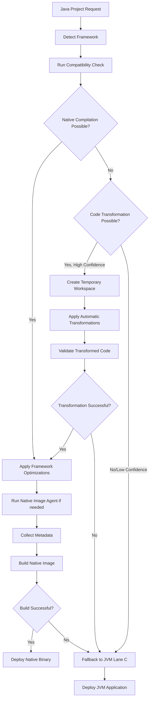

# GraalVM Native Image Compilation for Java Projects

## Executive Summary

This document provides comprehensive research on implementing GraalVM native image compilation with intelligent fallback to JVM for Java projects in the Ploy deployment system. The solution detects compilation feasibility, applies optimizations, and integrates with Ploy's deployment lanes.

## Current GraalVM Limitations (2025)

### Core Constraints
- **Closed-world assumption**: All code must be known at build time
- **Reflection limitations**: Runtime reflection requires explicit configuration via JSON files
- **Dynamic proxy restrictions**: Interface lists must be known at image build time
- **No runtime class loading**: Application classpath is fixed at build time
- **JVMTI unsupported**: Bytecode-based tools don't work with native images

### Critical Failure Modes
- **Fallback image generation**: When native compilation fails, GraalVM creates fallback files requiring JVM
- **Missing metadata**: Undetected reflection/dynamic features cause runtime failures
- **Third-party library incompatibility**: Not all libraries work with native images

## Build Tools Optimization Framework

### Spring Native (Spring Boot 3.x)
```yaml
optimizations:
  - AOT processing during build-time
  - Automatic hint generation for GraalVM
  - Built-in reflection configuration
  - Native image testing support
```

### Quarkus 
```yaml
features:
  - Compile-time dependency injection
  - Container-first optimizations
  - Native image build via: "./mvnw package -Dpackaging=native-image"
  - Automatic metadata collection
```

### Micronaut
```yaml
advantages:
  - Compile-time DI makes it uniquely suited for native compilation
  - Fastest startup times (<10ms)
  - Smallest memory footprint (1/5th of JVM)
  - Optimal for serverless/IoT applications
```

## Code Transformations for GraalVM Compatibility

### Framework-Specific Annotations & Modifications

#### **Spring Boot 3.x (2025 Modern Approach)**
```java
// Manual runtime hints when AOT doesn't cover edge cases
@Component
public class MyRuntimeHintsRegistrar implements RuntimeHintsRegistrar {
    @Override
    public void registerHints(RuntimeHints hints, ClassLoader classLoader) {
        hints.reflection().registerType(MyClass.class, MemberCategory.INVOKE_DECLARED_METHODS);
        hints.resources().registerPattern("static/**");
        hints.proxies().registerJdkProxy(MyInterface.class);
    }
}

// Disable CGLIB proxies for better native compatibility
@Configuration(proxyBeanMethods = false)
@EnableConfigurationProperties(MyProps.class)
public class Config {
    private static final String DEFAULT_VALUE = "constant"; // Static over dynamic
}
```

#### **Quarkus Annotations**
```java
// Basic reflection registration
@RegisterForReflection
public class MyModel {
    private String name;
    private int age;
}

// External classes that can't be modified
@RegisterForReflection(targets = {
    SomeThirdPartyClass.class,
    AnotherLibraryClass.class
}, serialization = true)
public class ReflectionConfig { }
```

#### **Micronaut Introspection (Reflection-Free)**
```java
// Compile-time introspection instead of runtime reflection
@Introspected
public class Person {
    private String name;
    private int age;
    // Getters/setters generate optimized accessor code
}

// DTO projections for database queries
@Introspected
public class BookDTO {
    private String title;
    private int pages;
}
```

### Automated Code Pattern Transformations

#### **Before/After Optimization Examples**

**1. Reflection Elimination**
```java
// BEFORE (problematic for GraalVM)
public Object createInstance(String className) {
    return Class.forName(className).newInstance();
}

// AFTER (GraalVM-friendly with static factory)
@RegisterForReflection(targets = {ServiceA.class, ServiceB.class})
public class StaticService {
    private static final Map<String, Supplier<Object>> FACTORIES = Map.of(
        "ServiceA", ServiceA::new,
        "ServiceB", ServiceB::new
    );
    
    public Object createInstance(String className) {
        return FACTORIES.get(className).get();
    }
}
```

**2. Dynamic Resource Loading → Static Registration**
```java
// BEFORE (dynamic path resolution)
public Properties load(String env) {
    return loadProps("config-" + env + ".properties");
}

// AFTER (static resource hints)
@Component
public class ConfigLoaderHints implements RuntimeHintsRegistrar {
    @Override
    public void registerHints(RuntimeHints hints, ClassLoader classLoader) {
        hints.resources().registerPattern("config-*.properties");
    }
}
```

**3. Proxy Replacement**
```java
// BEFORE (CGLIB proxy dependency)
@Configuration
public class CacheConfig {
    @Bean
    public UserService userService() {
        return new UserServiceImpl(); // Gets proxied at runtime
    }
}

// AFTER (explicit proxy-free implementation)
@Configuration(proxyBeanMethods = false)
public class CacheConfig {
    @Bean
    public UserService userService() {
        return new CacheableUserService(); // Explicit caching logic
    }
}
```

## Advanced Optimization Strategies

### Shared Native Image Caches & Build-Time Initialization
```bash
# Build-time initialization for faster startup
--initialize-at-build-time=package1,package2

# Auxiliary engine caching (experimental)
-H:+UseAuxiliaryEngineCaching

# Quick build mode for development
-Ob

# ML-powered optimization (GraalVM 24+)
-O3
```

### Native Image Agent Integration
```bash
# Agent-based metadata collection
java -agentlib:native-image-agent=config-output-dir=config/ App

# Conditional configuration for multiple code paths
-agentlib:native-image-agent=experimental-conditional-config-part

# Periodic configuration writing during runtime
-agentlib:native-image-agent=config-write-period-secs=30
```

## Solution Architecture

### Graal Native Module Structure
```
ploy-graal-native/
├── detector/           # Compatibility detection
├── transformer/        # Automatic code transformation
├── builder/           # Native image compilation
├── agent/             # Metadata collection
├── fallback/          # JVM fallback logic
└── integration/       # Ploy deployment hooks
```

### Enhanced Detection & Transformation Algorithm
```go
type GraalCompatibility struct {
    CanCompile          bool
    Issues              []string
    RequiresAgent       bool
    RequiresTransform   bool     // NEW: Code transformation needed
    TransformConfidence float64  // NEW: Confidence in transformation success
    Framework           string   // spring, quarkus, micronaut, plain
    FallbackReason      string
}

func DetectGraalCompatibility(projectPath string) GraalCompatibility {
    // 1. Framework detection
    // 2. Reflection usage analysis
    // 3. Dynamic proxy detection
    // 4. Third-party library compatibility check
    // 5. POSIX feature dependency scan
    // 6. Code transformation feasibility assessment
}

type CodeTransformer struct {
    openRewrite    *openrewrite.Engine
    llmAnalyzer    *LLMCodeAnalyzer
    staticAnalyzer *StaticAnalyzer
}

func (ct *CodeTransformer) CanTransformForGraalVM(projectPath string) (bool, float64) {
    // Analyze if code can be automatically transformed for GraalVM compatibility
    // Returns: (canTransform, confidenceScore)
}
```

### Enhanced Compilation Pipeline with Code Transformation


## Ploy Integration Points

### Lane Assignment Strategy
```yaml
lane_detection:
  native_graal: "F"    # New lane for GraalVM native images
  jvm_fallback: "C"    # Existing lane for JVM applications
  
detection_logic:
  - Check project for Spring Boot 3.x, Quarkus, or Micronaut
  - Run compatibility detector
  - Assign Lane F if native compilation viable
  - Fallback to Lane C if issues detected
```

### Modified Detector Integration
```go
// internal/lane/detector.go extension
func detectGraalNative(root string) (bool, []string) {
    frameworks := detectFrameworks(root)
    
    if frameworks.SpringBoot3x || frameworks.Quarkus || frameworks.Micronaut {
        compatibility := graal.DetectCompatibility(root)
        if compatibility.CanCompile {
            return true, []string{
                fmt.Sprintf("GraalVM native compilation available with %s", compatibility.Framework),
            }
        } else {
            return false, []string{
                fmt.Sprintf("GraalVM compilation blocked: %s", compatibility.FallbackReason),
            }
        }
    }
    return false, []string{}
}
```

### Deployment Commands
```bash
# Ploy deployment with GraalVM detection
ploy push <app> --graal-native --monitor

# Force JVM fallback
ploy push <app> --force-jvm --monitor

# Agent run for metadata collection
ploy push <app> --graal-agent-run --monitor
```

## OpenRewrite Integration

### Native Image Preparation Recipes
```yaml
recipes:
  spring_boot_native_prep:
    - upgrade_spring_boot_3x
    - add_native_image_hints
    - configure_aot_processing
    
  quarkus_native_optimization:
    - update_quarkus_native_profile
    - configure_container_build
    
  micronaut_graal_setup:
    - add_graal_annotations
    - configure_compile_time_di
```

### Recipe Execution for GraalVM
```java
// OpenRewrite recipe pipeline for GraalVM preparation
public class GraalVMNativePreparationRecipe extends Recipe {
    @Override
    public String getDisplayName() {
        return "Prepare project for GraalVM native compilation";
    }
    
    @Override
    protected List<Recipe> getRecipeList() {
        return Arrays.asList(
            new UpgradeSpringBoot_3_5(),
            new AddNativeImageHints(),
            new ConfigureAOTProcessing()
        );
    }
}
```

## Automated Code Transformation Strategies

### LLM-Driven Code Analysis and Transformation

#### **Pattern Detection Prompts**
```python
GRAALVM_OPTIMIZATION_PROMPT = """
Analyze this Java code for GraalVM native image compatibility issues:

1. Identify reflection usage patterns (Class.forName, getDeclaredMethod, etc.)
2. Detect dynamic proxy creation (Proxy.newProxyInstance)
3. Find resource loading with dynamic paths
4. Locate configuration classes missing @Configuration(proxyBeanMethods = false)
5. Identify classes needing @RegisterForReflection or @Introspected

Code:
{code}

Provide:
- List of detected issues with line numbers
- Specific transformation recommendations
- Framework-specific annotation suggestions
- Code snippets for fixes
"""

TRANSFORMATION_PROMPT = """
Transform this Java class for GraalVM native compilation:

Issues found: {issues}
Framework detected: {framework}

Apply these transformations:
1. Add appropriate annotations (@RegisterForReflection, @Introspected, etc.)
2. Replace reflection with static factories where possible
3. Convert dynamic resource loading to static hints
4. Optimize configuration classes for native compilation

Return the transformed code with explanatory comments.
"""
```

#### **Automation Coverage Analysis**
```yaml
automation_capabilities:
  fully_automatable:
    - framework_annotation_addition: 95%      # @RegisterForReflection, @Introspected
    - configuration_optimization: 90%        # proxyBeanMethods = false
    - static_resource_registration: 85%      # Resource hint generation
    - simple_reflection_elimination: 80%     # Basic Class.forName patterns
    
  semi_automatable:
    - complex_proxy_replacement: 70%         # Requires design decisions
    - dynamic_classloading_elimination: 60%  # Context-dependent patterns
    - serialization_handling: 65%           # Framework-specific approaches
    
  manual_review_required:
    - performance_critical_paths: 30%        # Requires profiling
    - third_party_integration: 40%          # Library-specific configurations
    - custom_native_configurations: 20%     # Complex reflection patterns
```

### OpenRewrite Recipe Implementation

#### **Complete Automation Pipeline**
```java
public class GraalVMTransformationSuite extends Recipe {
    @Override
    public String getDisplayName() {
        return "Complete GraalVM native image preparation";
    }
    
    @Override
    protected List<Recipe> getRecipeList() {
        return Arrays.asList(
            // Phase 1: Framework Detection & Upgrade
            new DetectFrameworkVersion(),
            new UpgradeToNativeSupportedVersions(),
            
            // Phase 2: Annotation Addition
            new AddRegisterForReflection(),
            new AddMicronautIntrospection(),
            new AddSpringRuntimeHints(),
            
            // Phase 3: Code Pattern Transformation  
            new EliminateReflectionPatterns(),
            new ConvertDynamicProxies(),
            new OptimizeResourceLoading(),
            
            // Phase 4: Configuration Optimization
            new DisableProxyBeanMethods(),
            new AddBuildTimeInitialization(),
            new OptimizeStartupConfiguration()
        );
    }
}

// Specific recipe example for reflection elimination
public class EliminateReflectionPatterns extends Recipe {
    @Override 
    public TreeVisitor<?, ExecutionContext> getVisitor() {
        return new JavaIsoVisitor<ExecutionContext>() {
            @Override
            public J.MethodInvocation visitMethodInvocation(J.MethodInvocation method, ExecutionContext ctx) {
                // Detect Class.forName patterns
                if (isClassForNameInvocation(method)) {
                    return transformToStaticFactory(method, ctx);
                }
                
                // Detect Method.invoke patterns  
                if (isMethodInvokeCall(method)) {
                    return transformToDirectCall(method, ctx);
                }
                
                return super.visitMethodInvocation(method, ctx);
            }
            
            private J.MethodInvocation transformToStaticFactory(J.MethodInvocation method, ExecutionContext ctx) {
                // Generate static factory replacement
                // Add @RegisterForReflection to class
                // Return transformed method invocation
            }
        };
    }
}
```

#### **Framework-Specific Recipe Examples**

**Spring Boot Optimization Recipe**
```java
public class SpringBootGraalVMOptimization extends Recipe {
    @Override
    protected List<Recipe> getRecipeList() {
        return Arrays.asList(
            new AddProxyBeanMethodsFalse(),
            new ConvertToRuntimeHintsRegistrar(),
            new OptimizeConditionalBeans(),
            new StaticizeConfigurationProperties()
        );
    }
}

public class AddProxyBeanMethodsFalse extends Recipe {
    @Override
    public TreeVisitor<?, ExecutionContext> getVisitor() {
        return new JavaIsoVisitor<ExecutionContext>() {
            @Override
            public J.Annotation visitAnnotation(J.Annotation annotation, ExecutionContext ctx) {
                if (TypeUtils.isOfClassType(annotation.getType(), "org.springframework.context.annotation.Configuration")) {
                    // Check if proxyBeanMethods already specified
                    if (!hasProxyBeanMethodsArgument(annotation)) {
                        return annotation.withArguments(addProxyBeanMethodsFalse(annotation.getArguments()));
                    }
                }
                return super.visitAnnotation(annotation, ctx);
            }
        };
    }
}
```

**Quarkus Annotation Recipe**
```java 
public class AddQuarkusReflectionAnnotations extends Recipe {
    @Override
    public TreeVisitor<?, ExecutionContext> getVisitor() {
        return new JavaIsoVisitor<ExecutionContext>() {
            @Override
            public J.ClassDeclaration visitClassDeclaration(J.ClassDeclaration classDecl, ExecutionContext ctx) {
                // Analyze class usage patterns
                if (requiresReflection(classDecl, ctx)) {
                    // Add @RegisterForReflection annotation
                    return classDecl.withLeadingAnnotations(
                        addRegisterForReflectionAnnotation(classDecl.getLeadingAnnotations())
                    );
                }
                return super.visitClassDeclaration(classDecl, ctx);
            }
            
            private boolean requiresReflection(J.ClassDeclaration classDecl, ExecutionContext ctx) {
                // Heuristic analysis:
                // - Used in reflection calls elsewhere in codebase
                // - Contains fields accessed via field reflection
                // - Used in serialization/deserialization
                // - Referenced in configuration files
            }
        };
    }
}
```

### Integration with Ploy GraalVM Module

#### **Automated Preparation Pipeline**
```go
type CodeTransformationEngine struct {
    llmClient       *openai.Client
    openRewrite     *openrewrite.Engine
    compatChecker   *CompatibilityChecker
}

func (e *CodeTransformationEngine) PrepareForGraalVM(projectPath string, framework string) (*PreparationResult, error) {
    // 1. Static analysis to detect problematic patterns
    issues := e.compatChecker.AnalyzeProject(projectPath)
    
    // 2. LLM-powered code analysis for complex patterns
    llmAnalysis := e.analyzeWithLLM(projectPath, issues)
    
    // 3. Apply OpenRewrite recipes for mechanical transformations
    openRewriteResult := e.openRewrite.ApplyRecipes(projectPath, selectRecipes(framework, issues))
    
    // 4. Generate manual review recommendations
    manualTasks := e.generateManualReviewTasks(llmAnalysis, openRewriteResult)
    
    return &PreparationResult{
        AutomatedChanges: openRewriteResult.Changes,
        ManualTasks:      manualTasks,
        ConfidenceScore:  calculateConfidence(issues, llmAnalysis),
    }, nil
}

func (e *CodeTransformationEngine) analyzeWithLLM(projectPath string, issues []Issue) *LLMAnalysis {
    prompt := buildAnalysisPrompt(issues)
    
    // Call LLM for complex pattern analysis
    response := e.llmClient.Analyze(prompt)
    
    return parseLLMResponse(response)
}
```

#### **Expected Automation Results**
```yaml
transformation_coverage:
  spring_boot_3x:
    automated: 85%        # AOT + recipes handle most cases
    manual_review: 15%    # Complex business logic patterns
    
  quarkus:
    automated: 80%        # Strong compile-time analysis
    manual_review: 20%    # Third-party integration edge cases
    
  micronaut:
    automated: 90%        # Best automation due to compile-time DI
    manual_review: 10%    # Minimal runtime dynamism
    
  plain_java:
    automated: 60%        # No framework assistance
    manual_review: 40%    # Requires more manual configuration
```

This automation strategy combines static analysis, LLM-powered code understanding, and OpenRewrite's mechanical transformations to systematically prepare Java applications for GraalVM native compilation while minimizing manual intervention.

## Pitfalls and Risk Mitigation

### Common Failure Scenarios
1. **Reflection without configuration**: Runtime failures in native images
   - *Mitigation*: Comprehensive agent-based metadata collection

2. **Third-party library incompatibility**: Libraries using unsupported features
   - *Mitigation*: Compatibility database and fallback triggers

3. **Build resource exhaustion**: Native compilation requires significant memory/CPU
   - *Mitigation*: Resource monitoring and automatic fallback

4. **Startup performance degradation**: Some apps slower in native mode
   - *Mitigation*: Performance benchmarking and selective compilation

### Detection Triggers for Fallback
```go
fallbackTriggers := []string{
    "Unsupported reflection patterns detected",
    "Dynamic class loading requirements found", 
    "Incompatible third-party libraries present",
    "Build resource limits exceeded",
    "Agent metadata collection incomplete",
}
```

## Implementation Roadmap

### Phase 1: Core Module Development
- [ ] Implement compatibility detector
- [ ] Create native image builder with fallback logic  
- [ ] Develop agent metadata collection system

### Phase 2: Ploy Integration
- [ ] Add Lane F for native images
- [ ] Modify lane detector for GraalVM projects
- [ ] Implement deployment command extensions

### Phase 3: OpenRewrite Integration  
- [ ] Develop GraalVM preparation recipes
- [ ] Create framework-specific optimization recipes
- [ ] Integrate with existing OpenRewrite pipeline

### Phase 4: Production Hardening
- [ ] Comprehensive testing across frameworks
- [ ] Performance benchmarking and optimization
- [ ] Documentation and deployment guides

## Expected Outcomes

### Performance Benefits
- **Startup time**: Sub-second startup vs 3-15 seconds JVM
- **Memory usage**: 50-80% reduction in memory consumption  
- **Container efficiency**: Smaller image sizes, faster cold starts
- **Serverless viability**: Enable Java in Lambda/serverless environments

### Risk Management
- **Zero-downtime fallback**: Automatic JVM deployment if native compilation fails
- **Gradual adoption**: Per-project opt-in with intelligent detection
- **Resource protection**: Build resource limits prevent system overload

This solution provides a comprehensive approach to GraalVM native image compilation within the Ploy ecosystem, balancing performance optimization with deployment reliability through intelligent fallback mechanisms.