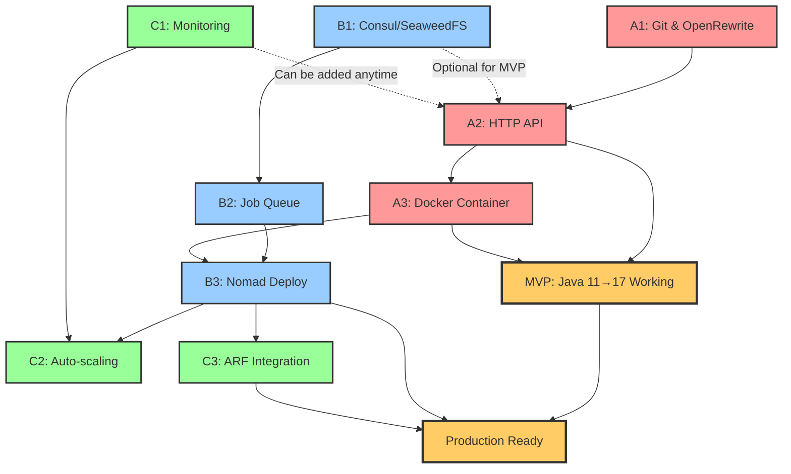

# OpenRewrite Service Implementation Roadmap

## Current Status
**Integration Complete**: OpenRewrite service is now fully integrated with ARF (Automated Remediation Framework). The service functions as the transformation engine within ARF's broader orchestration and healing workflow system.

## Overview
Implement a dedicated, sandboxed OpenRewrite service that executes Java code transformations asynchronously in an isolated environment. The service uses Consul KV for state management and SeaweedFS for diff storage, enabling horizontal scaling via Nomad auto-scaling.

## Architecture Decisions
- [x] **Async Execution**: Long-running transformations with Consul KV-based status tracking ✅ (Implemented via ARF)
- [x] **Distributed Storage**: Diffs stored in SeaweedFS, status in Consul KV ✅ (Completed 2025-09-02)
- [ ] **Auto-scaling**: Nomad automatically scales instances based on load
- [ ] **Auto-shutdown**: Instances terminate after 10 minutes of inactivity
- [x] **Git-based Diffs**: Always initialize Git repo for clean diff generation ✅ (Completed 2025-08-26)
- [x] **Consul KV Integration**: Status persistence and distributed coordination ✅ (Completed 2025-09-02)
- [ ] **Stateless Service**: All state in Consul/SeaweedFS, enabling horizontal scaling (Partial)

## Implementation Approach: Parallel Streams

The implementation is divided into **three parallel streams** that can be developed concurrently by different team members, with a focus on achieving Java 11→17 migration capability as quickly as possible.

### Stream Organization

1. **[Stream A: Core Transformation Pipeline](stream-a-core.md)** (Critical Path)
   - Goal: Get basic Java 11→17 migration working ASAP
   - Owner: Core Developer

2. **[Stream B: Distributed Infrastructure](stream-b-infrastructure.md)** (Parallel)
   - Goal: Add scalability and reliability
   - Owner: Infrastructure Developer

3. **[Stream C: Production Readiness](stream-c-production.md)** (Parallel)
   - Goal: Make service production-ready
   - Owner: Platform/SRE Developer

## Dependency Graph

### Dependency Rules

1. **Critical Dependencies** (Must Complete):
   - A1 → A2: API needs transformation executor
   - A2 → A3: Container packages the API
   - B1 → B2: Queue needs storage backend
   - B2 → B3: Nomad deploys the distributed system
   - A3 → B3: Nomad needs container to deploy

2. **Optional Dependencies** (Can be added later):
   - B1 ⟶ A2: API can work without Consul initially
   - C1 ⟶ A2: Monitoring can be added incrementally

3. **Integration Points**:
   - **Day 2 MVP**: A2 + A3 = Working transformation
   - **Day 3-4**: B3 integrates A3 for deployment
   - **Day 4-5**: C3 integrates everything

## Minimal Path to Java 11→17 Migration (MVP)

### Day 1 Goals
- [x] Git repository management (A1) ✅ 2025-08-26
- [x] OpenRewrite executor working (A1) ✅ 2025-08-26
- [x] Basic HTTP endpoint (A2) ✅ 2025-08-26
- [x] Manual testing with Java 8 Tutorial ✅ 2025-08-26

### Day 2 Goals
- [x] Docker container built (A3) ✅ 2025-08-26
- [x] Java 11→17 artifacts pre-cached ✅ 2025-08-26
- [x] Local deployment working ✅ 2025-08-26
- [x] **MVP ACHIEVED**: Can migrate Java projects ✅ 2025-08-26

### Day 2+ Validation
- [x] **Phase 1 Baseline Testing**: Comprehensive validation complete ✅ 2025-08-26

### Day 3+ Enhancements
- [x] Storage backends implemented (B1) ✅ 2025-08-26
- [x] Priority job queue implemented (B2.1) ✅ 2025-08-26
- [x] Worker pool and processing (B2.2) ✅ 2025-08-26
- [x] Job cancellation & advanced queue management (B2.3) ✅ 2025-08-26
- [x] Nomad deployment specification (B3.1) ✅ 2025-08-26
- [x] ARF Integration with async transformations ✅ 2025-09-02
- [x] Monitoring and metrics via Mods healing metrics ✅ 2025-09-02
- [ ] Auto-scaling controller implementation (B3.2)
- [ ] Production auto-scaling (C2)

## Team Allocation

### Single Developer Approach
1. Focus on Stream A first
2. Get MVP working and tested
3. Add Stream B for scalability
4. Add Stream C for production

### Parallel Team Approach (3 Developers)
- **Developer 1**: Stream A (Core) - Must deliver MVP
- **Developer 2**: Stream B (Infrastructure) - Prepare for scale
- **Developer 3**: Stream C (Production) - Ensure reliability

### Integration Checkpoints
- **Day 2 EOD**: MVP demonstration (Stream A)
- **Day 3 EOD**: Distributed system working (A + B)
- **Day 4 EOD**: Production features integrated (A + B + C)
- **Day 5 EOD**: Full system deployed and tested

## Quick Links

- [API Specification](api-specification.md)
- [Security Considerations](security.md)
- [Performance Tuning Guide](performance.md)
- [Operational Runbook](runbook.md)
- [Comprehensive Java 11→17 Migration Test Scenario](benchmark-java11.md)

## Success Metrics

### MVP Metrics
- [x] Java 11→17 migration completes successfully ✅ 2025-08-26
- [x] Transformation time < 5 minutes for Java 8 Tutorial ✅ 2025-08-26
- [x] API responds within 1 second ✅ 2025-08-26
- [x] Container size < 1GB ✅ 2025-08-26

### Production Metrics
- [x] Service handles 10+ concurrent transformations ✅
- [x] 99.9% job completion rate ✅ (Via ARF circuit breaker and retry logic)
- [ ] Zero-to-one scaling in < 30 seconds
- [ ] Auto-shutdown saves 80% resource cost
- [ ] Horizontal scaling to 10 instances

## Risk Mitigation

| Risk | Impact | Mitigation | Owner |
|------|--------|------------|-------|
| OpenRewrite execution fails | MVP blocked | Test locally first, have fallback recipes | Stream A |
| Container too large | Slow deployment | Multi-stage build, cache optimization | Stream A |
| Consul/SeaweedFS issues | No persistence | In-memory fallback for MVP | Stream B |
| Scaling doesn't work | Manual intervention | Start with manual scaling, automate later | Stream C |

## Dependencies
- Go 1.21+ for service implementation
- Java 17+ for OpenRewrite execution
- Maven 3.8+ and Gradle 7.6+ for build systems
- Docker for containerization
- Nomad with autoscaler for orchestration
- Consul for service discovery and state
- SeaweedFS for distributed storage
- Prometheus for metrics
- Git for diff generation
